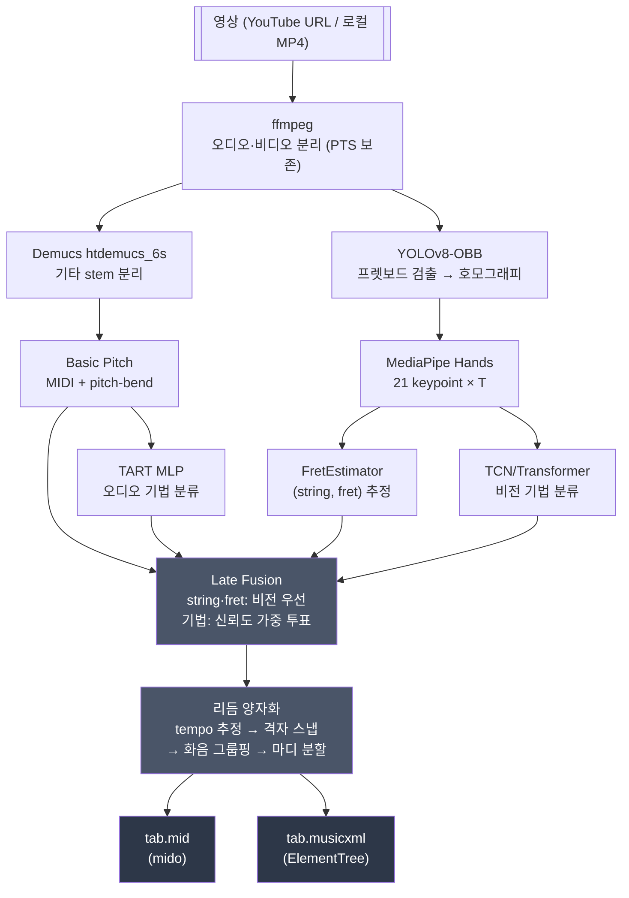

# guitarvideo2tab

기타 연주 영상(YouTube 등) → **MIDI(.mid) + MusicXML(.musicxml)** 자동 변환 멀티모달 파이프라인.

MusicXML 은 MuseScore · Guitar Pro · TuxGuitar 가 모두 읽는 표준 교환 포맷이며,
`<technical><string>/<fret>` 으로 TAB 운지를 표기합니다.

> 표현 기법(bend, slide, hammer-on, vibrato 등)까지 포함한 종단간 변환을 목표로 합니다.

## 핵심 원칙

**"오디오는 무엇을(what), 비디오는 어디서·어떻게(where & how)"**

같은 음이라도 기타에서는 여러 (현, 프렛) 조합으로 낼 수 있습니다. 오디오만으로는
이 모호성을 풀 수 없고, 영상의 손 위치가 직접적인 답을 줍니다. 반대로 어떤 음이
울렸는지는 오디오가 훨씬 정확합니다. 이 상보성이 프로젝트의 존재 이유입니다.

## 아키텍처



두 출력은 **같은 틱 격자**(4분음표 = 960틱)에서 파생되므로 MIDI 와 악보의 리듬이
정확히 일치합니다. 이 값은 MIDI 의 `ticks_per_beat` 이자 MusicXML 의 `divisions` 입니다.

## 빠른 시작

```bash
# 의존성 설치 (uv 권장)
uv sync --extra dev

# 실행 — 산출물은 runs/<타임스탬프>_<슬러그>/ 에 격리됩니다
uv run python -m guitarvideo2tab "https://youtube.com/watch?v=..."
uv run python -m guitarvideo2tab path/to/video.mp4

# tempo 고정 (librosa 가 2배로 잡을 때)
uv run python -m guitarvideo2tab video.mp4 --tempo 72

# 지난 실행 목록 / 최신 결과 열기
uv run python -m guitarvideo2tab list
open runs/latest/output/tab.musicxml
```

시스템 의존성: `ffmpeg`

## 산출물

실행 **하나가 디렉토리 하나**를 씁니다. trial 을 반복해도 파일이 섞이지 않습니다.

```
runs/20260726-000610_주이름-찬양-Verse-1/
├── manifest.json   입력·설정·git 커밋·단계별 소요시간·결과 통계
├── input/
├── stages/         video.mp4 · audio.wav · guitar.wav
│                   04_midi_events.json ~ 10_notes_fused.json
└── output/         tab.mid · tab.musicxml
```

`manifest.json` 에 **실행 시점의 git 커밋**이 기록되어 어느 코드로 낸 결과인지
추적됩니다. 상세는 [runs/README.md](runs/README.md) 참조.

## 상태

**전체 14개 모듈 구현 완료**, 165 tests PASS · ruff clean.
실제 영상으로 종단간 실행이 검증되었습니다.

### 실측 성능

37.6초 / 1129프레임 영상, Apple M1 Pro (CPU 추론) 기준 — 총 **173초**.

| 단계 | 시간 |
|------|-----:|
| YOLOv8-OBB 프렛보드 | 82.1s |
| MediaPipe Hands | 46.9s |
| Demucs 기타 stem | 30.6s |
| ffmpeg 분리 | 10.9s |
| Basic Pitch 채보 | 1.4s |
| Fusion + 출력 | < 0.1s |

**비전 경로가 전체의 75%** 입니다. 프레임 단위 추론이라 영상 길이에 선형
비례하므로, 긴 영상은 프레임 샘플링이나 GPU 가속이 필요합니다.

### 알려진 한계

| 항목 | 상태 |
|------|------|
| **string/fret 배정이 pitch 를 참조하지 않음** — 배정된 운지가 그 음을 못 내는 경우가 있음 (`fingering_match_ratio` 로 노출) | 🔴 최우선 |
| 폐색 시 오디오 폴백 미구현 — 해당 음이 악보에서 누락 | ⚠️ |
| 기법 분류기 가중치 미공개 (TART · Mitsou 2023) → 기법 라벨이 항상 비어 있음 | ⏸️ 외부 의존 |
| 마디를 넘는 긴 음이 타이 없이 잘림 · 박자표 4/4 고정 · 잇단음표 미지원 | ⚠️ |

MusicXML 은 `<pitch>` 를 항상 기록하되 운지가 pitch 와 모순되면 `<technical>` 을
생략합니다 — **틀린 악보 대신 불완전한 악보**를 내보내는 편이 안전하기 때문입니다.

## 문서

- [docs/domain/architecture.md](docs/domain/architecture.md) — 전체 파이프라인 구조
- [docs/domain/features.md](docs/domain/features.md) — F1~F11 기능 목록
- [docs/domain/coding-style.md](docs/domain/coding-style.md) — 기술 스택과 코딩 규칙
- [docs/domain/build-test.md](docs/domain/build-test.md) — 빌드/테스트 환경, 실측 소요 시간
- [docs/domain/source-index.md](docs/domain/source-index.md) — 모듈/함수 인덱스, 알려진 결함
- [docs/domain/decisions/](docs/domain/decisions/) — Architecture Decision Records

## 라이선스

TBD
